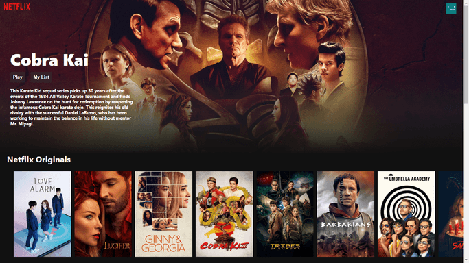

# Netflix-Clone

implemented from the knowledge learnt from [Clever Programmer](https://www.youtube.com/channel/UCqrILQNl5Ed9Dz6CGMyvMTQ)
This is a front-end clone of Netflix that displays the trailers and is deployed using Firebase.
API used from [TMDB Movie Api](https://www.themoviedb.org/documentation/api)

## Technologies learnt and used

- **ES7** and **ES6** javascript syntax
- React js
- Use of **React Hooks**
- Youtube trailer used from **react-youtube** package
- CSS designs to mimic the actual Netflix Website

Output can be viewed [**here**](https://netflix-clone-64ba6.web.app/)

# Bug:

Not all of the trailers diplay when you click on an image.
